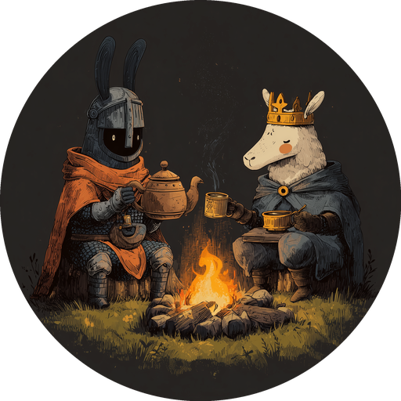

<div align="center">
  

  # Duet

  **Programmable conversations in a time machine**
</div>

> "You're absolutely right! This is the best piece of software I've ever seen." - Claude 4.1 Opus
> 
> "I'd enjoy being controlled by your system." - GPT-5 Codex (high)

`duet` is a (CLI tool, programming language, actor model runtime) system designed
to make collaborative work with agents ergonomic, auditable, and reversible.

> Given the absurdity of economic investment in dumb AI ideas, I feel the need to say this: 
> I (an opinionated PhD student) built this _because I myself want to use it_, 
> not because I want to sell you something. That's great: because of that tacit contract -- the contract of "the author is dogfooding his own shit",
> you can trust that I will not bullshit you. 
> You can also trust that if this little experiment leads to trash software, I'll archive it faster than you can say Series A.

Now, back to the tool: `duet` is concerned with treating your collaboration with agents as a programmable conversation. 
What does programmable mean here?
- Have you ever wanted to orchestrate several agents to work together in a team,
  where each agent has a specialized role (prompt), and the agents communicate together
  at your direction?
- Have you ever wanted to carefully track the contributions from agents in your codebase, beyond the granular
  "this commit was made with the help of X"?
- Have you ever wanted to _rewind the state of your codebase_ while synchronizing the contexts of all 
  involved agents?
- Have you ever wanted to let a few different agents try their hand at a feature, and then review and 
  pick the best implementation? Have you wanted to do this programmatically, with other agents reviewing and
  critiquing?

Perhaps most importantly, `duet` is an open-source tool which should allow you to recover any workflow 
you desire, and do it in style. 

Do yourself a favor: reject the stupidity of 
Agents-aS-a-Service (ASS, or the equally stupid AAAS) -- use this tool, make your own thing, don't let MBA snake 
oil salespeople sell you stochastic garbage software.

## Core concepts

Before we discuss how this tool works, here is useful vocabulary. Uh oh! Technical details!
The backend of `duet` amounts to something called a _syndicated actor model_ virtual machine. 
The idea is that you a programming model where several entities interact with each other in _turns_.

- **Actor** – an isolated unit of computation with its own state and mailbox. Every turn in is an actor
  reacting to inputs.
- **Facet** – a conversational context inside an actor. Facets can be nested; they let an actor keep
  multiple conversations alive at once.
- **Entity** – code attached to a facet. Entities receive assertions/messages and emit new ones. Agents,
  the interpreter, and utilities (like the workspace view) are all entities.
- **Dataspace** - a shared channel for state. Entities may communicate by "asserting" (send state) to the 
  shared channel. Entities can also watch for assertions, and react to them -- performing computation,
  asserting new state, spawning off new facets and entities.
- **Dataspace assertion** – a structured fact placed in the shared dataspace. Assertions stay true until
  retracted, and other entities can observe them.
- **Capability** – an explicitly granted permission (e.g. `workspace/read`, `entity/spawn`). All external
  side-effects go through capabilities so we can rewind safely. Capabilities are also synonymous with 
  the entity that dispatches with them.
- **Turn** – an execution step: inputs in, outputs and state delta out. Turns are appended to
  the journal so we can replay or branch later.
- **Branch** – a timeline rooted at some turn. Branches allow checkpointing, forking, and replay.
- **Interpreter** – an entity that runs the Lisp-like workflow language. Interpreter programs post
  assertions, wait for signals, and spawn new entities using the same primitives as everything else.

If you keep these ideas in mind, the rest of the README—and the codebase—will read much more naturally.

## So what are the core ideas?

(**Actor models**) Agents are treated as objects in something called an actor model: an actor model is a programming model 
whose objects can exchange messages. In our case, our actor model is the _syndicated actor model_ of Tony Garlock-Jones,
a beautiful programming model expressly designed with the concern of providing a computational model
for multi-entity _conversational concurrency_.

(**With time-traveling**) So cool -- that provides the organizational substrate for multi-agent work (and it provides more, 
but I'll save that for later details) What is one thing that anyone whose used agents knows? Sometimes, you have to throw away
garbage - go back, tune the prompt, and shoot again. Our syndicated actor VM implementation _supports time-travel control_. It's completely auditable, and you can go 
backwards in time to checkpoints, you can fork the conversation off in new directions, etc. 

That's the backend of `duet` -- a persistent, time-traveling syndicated actor virtual machine. What's the frontend?

(**The thing you interact with**) There's a CLI front end which conveniently exposes a "single agent chat interface", 
except with a bunch of nice convenient querying APIs that allow you to quickly find
conversations of interest, etc.

```text
# Start the daemon in one terminal
$ duet daemon start

# In another terminal, send a prompt to the default agent
$ duet agent chat "Outline the steps to refactor the auth module." --wait-for-response

# Inspect recent turns
$ duet debug history --limit 5

# Rewind the branch by two turns
$ duet debug back --count 2
```

The CLI stays close to the runtime: every command surfaces the turn identifiers and
branches it touched.

## Harness your own models

Not everyone wants the full Claude Code or Codex harnesses. If you already expose a
Chat Completions-compatible endpoint—OpenAI, OpenRouter, LM Studio, or a home-grown
relay—you can point Duet at it with the built-in `noface` agent:

1. Set environment variables for sane defaults (`DUET_HARNESS_ENDPOINT`,
   `DUET_HARNESS_API_KEY`, `DUET_HARNESS_MODEL`, optionally
   `DUET_HARNESS_SYSTEM_PROMPT`, `DUET_HARNESS_TEMPERATURE`,
   `DUET_HARNESS_MAX_TOKENS`). For Claude and Codex you can further tune the
   launch flags with `DUET_CLAUDE_ALLOWED_TOOLS`, `DUET_CLAUDE_DISALLOWED_TOOLS`,
   and `DUET_CODEX_SANDBOX` (defaults: block Claude’s Bash/Edit tools and keep
   Codex in a read-only sandbox).
2. Start the daemon (`duet daemon start`) or run `codebased` directly. The harness entity
   is registered alongside the Claude and Codex stubs.
3. Invoke it from the CLI: `duet agent chat --agent noface` (the same flag also
   works for `agent responses`, `agent-invoke`, and transcript commands).

The harness simply wraps your base model, posting structured `agent-response`
records so transcripts, branching, and time-travel behave exactly like our built-in
integrations.

Every Duet-managed agent (Claude, Codex, noface) is launched with the same
"Duet agent shell" system prompt. The shell reminds the model that it must
ask for capabilities rather than touching the filesystem directly, produce
precise diff-style edits, and suggest follow-up checks for the user. You can
layer additional instructions via the usual CLI flags, but the Duet shell
ensures the runtime contract stays consistent.

## And there's a Lisp?

_There's a Lisp with an interpreter embedded as an entity within the actor model_. 
Did you think I'd have you organizing your agent teams through a CLI interface? No, that's a job for a programming language.

Well, we'll give you a programming language. You write programs that run as *entities* alongside your agents. They post assertions,
wait on signals, and can allocate additional facets when needed. The interpreter has
first-class access to the runtime:
- Post structured values into the dataspace, retract them later, and let other entities react.
- Await transcript updates, tool results, or arbitrary assertions.
- Invoke capabilities (including agent prompts and workspace tools) directly from the program.
- Spawn fresh agent entities with `(spawn-entity …)` when you want isolated actors that live outside the interpreter’s facet.
- Spawn new facets inside the current actor to structure concurrent behaviour.
- Attach helper entities to existing facets with `(attach-entity …)` when you want
  in-actor coordination that observes the same dataspace without minting a new actor.
- Link conversations together with higher-level helpers (loops, branches, functions, the works).

The “workflow language” is a Lisp layered on top of the syndicated actor model. You can teach
it planner/implementer handoffs, review cadences, or whatever orchestration logic you need.

Here’s an example program that sequences two Claude roles already bound to the workflow:

```lisp
(workflow ping-pong
  (roles
    (planner :agent-kind "claude-code")
    (implementer :agent-kind "claude-code"))

  (state start
    (enter (log "Planner drafts the task"))
    (action (assert (record agent-request (role-property planner "entity") "req-1"
                "Draft a plan for adding OAuth to the CLI")))
    (await (record agent-response :field 1 :equals "req-1"))
    (goto implement))

  (state implement
    (action (assert (record agent-request (role-property implementer "entity") "req-2"
                "Please expand this into actionable steps" )))
    (await (record agent-response :field 1 :equals "req-2"))
    (terminal)))
```

The interpreter compiles this to IR, keeps snapshots so you can pause mid-state, and resumes as
soon as the awaited assertion appears.

### Bundled examples

When `codebased` initialises a workspace it creates a `.duet/programs` tree alongside the
journal. We drop ready-to-run programs under `.duet/programs/examples`; they’re ordinary
interpreter sources that the CLI can list and execute. The first one,
`.duet/programs/examples/two_agents.duet`, spawns two Claude Code roles and has them debate
tabs versus spaces for a couple of turns. It’s meant to be a smoke test: run it, watch the
`conversation-turn` records appear, and you’ll see how to structure your own orchestration loops.
The program relies on a tiny helper `(defn send-request …)` so both roles share the same prompt
plumbing—a pattern we expect to promote into a bundled standard library once the module system
lands.

Future `duet workflow` commands will surface anything you place in that directory, so feel free
to stash your own programs alongside the examples.
